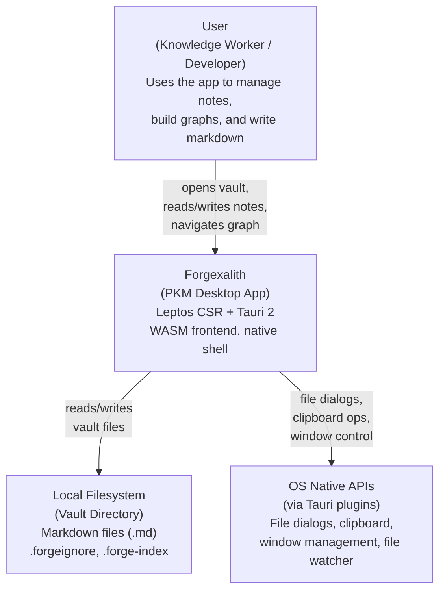

# C4-L1 — System Context

C4 level 1 diagram: the Forgexalith system boundary.

## Overview

Forgexalith is a desktop PKM application that runs on Windows, macOS, and Linux. It interacts with the end user (knowledge worker / developer) and accesses the local filesystem and the OS native APIs via Tauri.

## Detailed descriptions

### User (Persona)
- **Type**: Person
- **Context**: Knowledge worker or developer.
- **Interaction**: Uses Forgexalith to create, organize, and explore interconnected notes. Performs actions such as creating new notes, editing markdown, navigating the backlinks graph, using the canvas, and running searches.

### Forgexalith (System)
- **Type**: Software System
- **Scope**: The full application, including the WASM frontend (Leptos), the desktop shell (Tauri 2), and the Rust backend crates (forge-core, forge-vault, forge-graph, forge-editor, forge-canvas).
- **Responsibilities**: Render the UI, manage markdown editing, maintain the search index, build and render the notes graph, and stay in sync with the filesystem.

### Local Filesystem (External System)
- **Type**: External System
- **Scope**: The vault directory (user folder containing the `.md` notes).
- **Responsibilities**: Persist user data, maintain the hierarchical note structure.
- **Relationship**: Watched in real time by `VaultWatcher` via `StorageBackend` (`RealFs` / `MemoryFs`).

### OS Native APIs (External System)
- **Type**: External System
- **Scope**: APIs provided by the operating system (Windows, macOS, Linux) through Tauri plugins.
- **Responsibilities**: Provide access to file dialogs, clipboard, window management, file system watcher, hotkeys.
- **Relationship**: Invoked through Tauri IPC commands.

---

## Main data flows

1. **User → Forgexalith**: UI interactions (opening a vault, editing notes, navigation).
2. **Forgexalith → Filesystem**: Reading and writing `.md` files and metadata.
3. **Forgexalith → OS APIs**: File dialog requests, clipboard read/write, window management.
4. **Filesystem → Forgexalith**: File change notifications (via the file watcher).

---

## Key elements

- **Frontend**: Leptos 0.7 CSR compiled to WASM (via Trunk).
- **Shell**: Tauri 2 with WebView2 (Windows), WebKit (macOS), WebKitGTK (Linux).
- **Storage**: Filesystem-based, with `.forgeignore` and live reload through `VaultWatcher`.
- **Backend**: Modular Rust crates (forge-core, forge-vault, forge-graph, forge-editor, forge-canvas, forge-ui).

---

## Constraints and assumptions

- **Offline-first**: Forgexalith works without an internet connection (no cloud sync).
- **Single-device**: Only one instance per vault at a time (file locks via `VaultWatcher`).
- **Filesystem-bound**: Persistence depends on access to the local vault directory.
