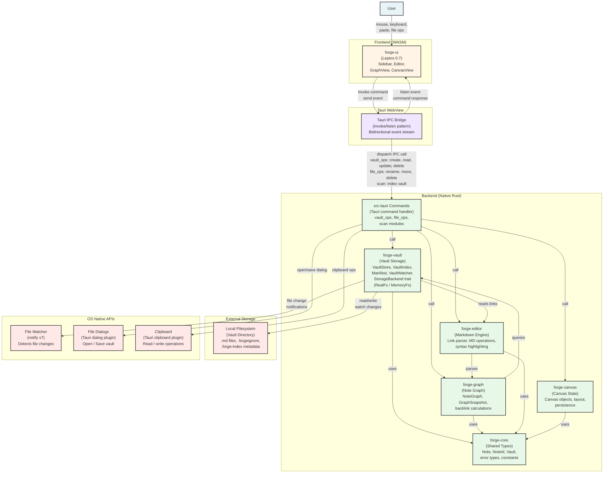

# C4-L2 — Container Diagram

C4 level 2 diagram: Forgedsidian's internal architecture (containers and relationships).

## Overview

Forgedsidian is composed of several containers (Rust crates, WASM artefact, Tauri process) that communicate through Tauri IPC and in-process function calls. The system is split into three layers: **Frontend (WASM)**, **IPC Bridge (Tauri)**, and **Backend (native Rust)**.

## Container descriptions

### **Frontend (WASM)**

#### `forge-ui` — Leptos 0.7 CSR
- **Technology**: Rust → WASM (built via Trunk).
- **Main components**:
  - `Sidebar`: vault navigation, note list, search.
  - `Editor`: markdown editor with live preview.
  - `GraphView`: interactive backlinks graph (force-directed SVG, wgpu in progress).
  - `CanvasView`: canvas for spatial outliner / drawing layer.
- **State**: managed via Leptos signals and derived signals.
- **Interaction**: IPC with the backend via Tauri, plus clipboard / paste events.
- **Responsibilities**: render the UI, manage frontend state, handle user events.

---

### **IPC Bridge**

#### Tauri IPC Bridge
- **Pattern**: invoke/listen (bidirectional).
- **Encoding**: JSON serialization (serde).
- **Latency**: < 1 ms intra-process (Tauri 2 optimised).
- **Responsibilities**: marshal command calls, dispatch backend events to the frontend.
- **Security**: command allowlist, argument validation.

---

### **Backend (Native Rust)**

#### `src-tauri` — Tauri Command Layer
- **Role**: entry point for IPC commands.
- **Modules**:
  - **vault_ops**: `create_note`, `update_note`, `delete_note`, `list_notes`, `search`, `get_vault_index`.
  - **file_ops**: `rename_note`, `move_note`, `delete_file`, `export_vault`.
  - **scan**: `index_vault`, `rebuild_index`, `rescan_vault`.
- **Responsibilities**: argument validation, logging, error handling, delegation to domain crates.

---

#### `forge-vault` — Vault Storage Engine
- **Role**: core of persistence and indexing.
- **Components**:
  - **VaultStore**: CRUD interface for notes (abstracted over `StorageBackend`).
  - **VaultIndex**: Tantivy full-text index, fast search.
  - **Manifest**: vault metadata (version, config, settings, HMAC signature).
  - **VaultWatcher**: file change detection, incremental reload.
  - **StorageBackend trait**: abstraction for `RealFs` (filesystem) / `MemoryFs` (tests).
- **Responsibilities**: persistence, indexing, FS sync, conflict detection.

---

#### `forge-graph` — Note Graph Engine
- **Role**: build and query the backlinks graph.
- **Components**:
  - **NoteGraph**: directed graph (notes → links).
  - **GraphSnapshot**: immutable snapshot for rendering.
  - **Link resolution**: resolve `[[wikilink]]` → `NoteId`.
- **Responsibilities**: backlink computation, cycle detection, snapshot generation, query optimisation.

---

#### `forge-editor` — Markdown Engine
- **Role**: parse and manipulate markdown.
- **Components**:
  - **Link parser**: extract `[[wikilink]]` and `[text](url)`.
  - **MD operations**: insert link, update YAML frontmatter, code block parsing.
  - **Syntax rules**: Forgedsidian dialect (CommonMark-compatible).
- **Responsibilities**: AST parsing, link detection, syntax validation, HTML sanitization.

---

#### `forge-canvas` — Canvas State Manager
- **Role**: manage canvas state (spatial outliner, drawings).
- **Components**:
  - **Canvas objects**: nodes, edges, text, shapes.
  - **Layout engine**: automatic placement (force-directed or hierarchical).
  - **Persistence**: canvas serialised to JSON in `.forgedsidian/`.
- **Responsibilities**: canvas state management, layout calculations, undo/redo.

---

#### `forge-core` — Shared Types
- **Role**: types shared across all crates.
- **Key types**:
  - `Note`: struct holding content, frontmatter, metadata.
  - `NoteId`: unique identifier (UUID).
  - `Vault`: collection of notes.
  - `VaultError`: enumeration of errors (file not found, invalid link, etc.).
- **Responsibilities**: define contracts, serialisation versions.

---

### **Storage (External)**

#### Local Filesystem — Vault Directory
- **Format**: tree of `.md` files plus metadata.
- **Special files**:
  - `.forgeignore`: exclusion patterns (similar to `.gitignore`).
  - `.forge-index/`: persistent index state (manifest, audit log, Tantivy index).
  - `.forgedsidian/`: app-local state (canvas drawings, etc.).
- **Synchronisation**: `VaultWatcher` detects changes and notifies forge-vault.

---

### **OS APIs (External)**

#### File Watcher (notify v7)
- File creation / modification / deletion notifications.
- Used by `VaultWatcher` for live reload.

#### File Dialogs (Tauri dialog plugin)
- Open vault directory, save / export files.

#### Clipboard (Tauri clipboard plugin)
- Read / write the system clipboard (paste in editor, copy links).

---

## Main data flows

### Scenario 1: user edits a note
1. User types in the `Editor` (forge-ui).
2. Leptos signal triggers `on_change` → IPC `update_note`.
3. `src-tauri` receives → `vault_ops::update_note`.
4. `VaultStore` updates the FS and the `VaultIndex` (Tantivy).
5. `VaultWatcher` detects the FS change.
6. `forge-graph` recomputes backlinks if links changed.
7. New index emitted through IPC `listen event_index_updated` → forge-ui re-renders the GraphView.

### Scenario 2: user navigates the graph
1. User clicks a node in `GraphView`.
2. IPC → `vault_ops::get_note(note_id)`.
3. `VaultStore` + `VaultIndex` retrieve the note.
4. `forge-graph` computes `GraphSnapshot` (1-hop or 2-hop).
5. Data returned → forge-ui re-renders the GraphView.

### Scenario 3: user opens a new vault
1. User clicks "Open Vault" → file dialog (OS API).
2. IPC → `vault_ops::open_vault(path)`.
3. `VaultWatcher` recursively scans the directory.
4. `forge-vault` indexes all `.md` files (Tantivy build).
5. `VaultIndex` is ready → IPC `event_vault_opened` with metadata.
6. forge-ui shows the vault in the Sidebar.

---

## Technical dependencies

| Crate | Depends on |
|-------|------------|
| forge-ui | forge-core |
| src-tauri | forge-vault, forge-graph, forge-editor, forge-canvas |
| forge-vault | forge-core, forge-editor, Tantivy (search), tokio (async) |
| forge-graph | forge-core, forge-vault |
| forge-editor | forge-core |
| forge-canvas | forge-core |

---

## Scalability and risks

### Scalability
- **Large vaults** (> 10 000 notes): Tantivy indexing can be expensive; async background indexing is recommended.
- **GraphView rendering**: 2D canvas works up to ~1 000 nodes; 3D / GPU rendering requires optimisation (frustum culling, batching).
- **VaultWatcher**: native OS file watcher, with OS-imposed limits (e.g. inotify on Linux).

### Risks
- **FS concurrency**: multiple Forgedsidian instances on the same vault can race; file locks recommended.
- **FS ↔ index sync**: `VaultWatcher` may miss changes after a crash; a periodic full rescan is recommended.
- **Canvas state corruption**: a corrupted `.forgedsidian/` JSON may lose layout; validation and recovery recommended.

---

## Planned evolution

- **StorageBackend abstraction**: prepares for future S3 / cloud storage support.
- **Plugin system**: hooks in forge-editor and forge-graph for third-party extensions.
- **CRDT synchronisation**: for future multi-user collaboration (Yrs, automerge).
